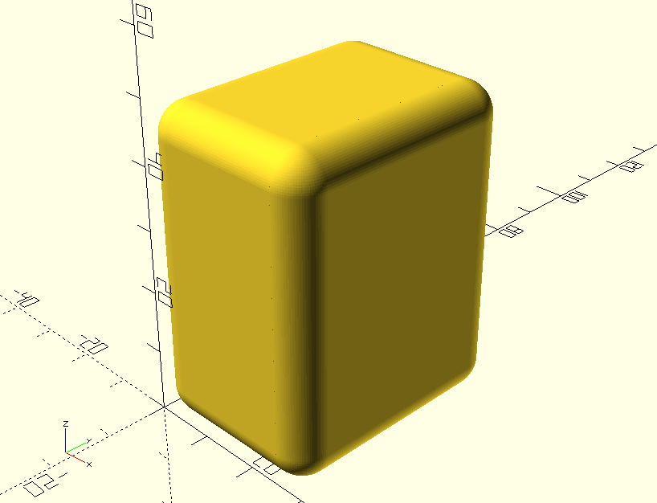

#An OpenScad function to generate a bevelled cube

Jenny List 2025
CC-BY-SA 4.0

##About
This is not the most elegant way to generate a bevelled cube. I needed one, and threw this together. It works by carving out the corners and rounded edges, then putting spheres at the corners to make them rounded.

##Usage:

`bevelledCube(x,y,z,radius);`

where x,y, and z are the dimensions of the cube, and radius is the desired bevel radius.

Values of radius greater than x, y, or z, will produce odd results.

Smoothness of the curves is as always dictated by a global value of $fn.

###Example:
`$fn=90;
bevelledCube(30,40,50,5);`

